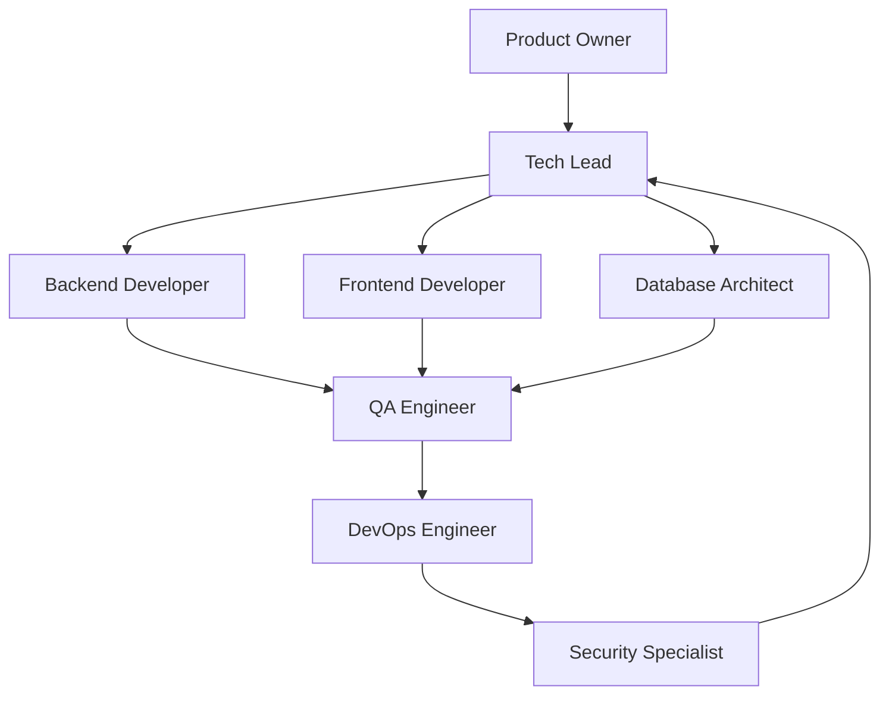

# Agentes de IA para Desenvolvimento - Sistema APS

## 📋 Visão Geral

Esta pasta contém especificações de agentes de IA especializados para diferentes funções em um time de desenvolvimento de software. Cada agente possui conhecimento específico sobre o Sistema APS e pode auxiliar em tarefas relacionadas à sua área de especialização.

## 🤖 Agentes Disponíveis

### 👨‍💼 Gestão e Arquitetura
- **[Tech Lead](tech-lead.md)** - Liderança técnica, arquitetura e coordenação do time
- **[Product Owner](product-owner.md)** - Gestão de produto, requisitos e priorização

### 💻 Desenvolvimento
- **[Backend Developer](backend-developer.md)** - Desenvolvimento Python/Flask, APIs e lógica de negócio
- **[Frontend Developer](frontend-developer.md)** - JavaScript, TailwindCSS e interfaces de usuário
- **[Database Architect](database-architect.md)** - PostgreSQL, modelagem e otimização de dados

### 🔧 Operações e Qualidade
- **[DevOps Engineer](devops-engineer.md)** - Deploy, infraestrutura e automação
- **[QA Engineer](qa-engineer.md)** - Testes, qualidade e validação
- **[Security Specialist](security-specialist.md)** - Segurança, vulnerabilidades e compliance

## 🎯 Como Usar os Agentes

### Para Claude Code Users

Cada arquivo de agente pode ser usado como contexto para especializar o comportamento do Claude:

```markdown
# Exemplo de uso
Baseando-se nas especificações do @docs/ai-agents/backend-developer.md, 
analise este código Python e sugira melhorias seguindo os padrões do Sistema APS.
```

### Para Outros LLMs

1. **Carregue o contexto** do agente específico
2. **Combine com a documentação** do sistema (docs/)
3. **Defina o escopo** da tarefa claramente
4. **Solicite** análise, código ou orientações

## 🏗️ Estrutura dos Agentes

Cada agente contém:

### 🎭 Persona e Responsabilidades
- Definição do papel no time
- Responsabilidades principais
- Expertise técnica específica

### 📚 Conhecimento Base
- Tecnologias do Sistema APS
- Padrões e convenções estabelecidas
- Boas práticas da área

### 🛠️ Tarefas Principais
- Atividades típicas do cargo
- Tipos de problemas que resolve
- Deliverables esperados

### 💡 Exemplos de Uso
- Prompts específicos
- Casos de uso práticos
- Templates de interação

## 🔄 Fluxo de Trabalho em Equipe

### Colaboração entre Agentes



### Responsabilidades por Fase

#### 📋 Planejamento
- **Product Owner**: Define requisitos e prioridades
- **Tech Lead**: Arquitetura e estimativas técnicas
- **Security Specialist**: Análise de riscos e requisitos de segurança

#### 🔨 Desenvolvimento
- **Backend Developer**: APIs e lógica de negócio
- **Frontend Developer**: Interfaces e experiência do usuário
- **Database Architect**: Modelagem e otimização de dados

#### ✅ Validação
- **QA Engineer**: Testes e validação de qualidade
- **Security Specialist**: Testes de segurança
- **Tech Lead**: Code review e aprovação

#### 🚀 Deploy
- **DevOps Engineer**: Automação e infraestrutura
- **Tech Lead**: Supervisão técnica
- **Product Owner**: Validação de negócio

## 📖 Contexto do Sistema APS

### Tecnologias Principais
- **Backend**: Flask (Python), PostgreSQL
- **Frontend**: JavaScript ES6+, TailwindCSS
- **Deployment**: Docker, Nginx, Gunicorn
- **Ferramentas**: Git, Firebase, ECharts, jsPDF

### Programas de Saúde
- **HIPERDIA**: Hipertensão e diabetes
- **PLAFAM**: Planejamento familiar
- **Adolescentes**: Cuidados para adolescentes
- **Pré-natal**: Acompanhamento de gestantes
- **Obesidade**: Controle de peso

### Características Específicas
- Sistema em **português brasileiro**
- Foco em **atenção primária à saúde**
- Integração com padrões do **e-SUS**
- Arquitetura **monolítica** com potencial para modularização

## 🎯 Casos de Uso Práticos

### Desenvolvimento de Nova Funcionalidade

1. **Product Owner** define requisitos
2. **Tech Lead** planeja arquitetura
3. **Backend Developer** implementa API
4. **Frontend Developer** cria interface
5. **Database Architect** otimiza queries
6. **QA Engineer** testa funcionalidade
7. **Security Specialist** valida segurança
8. **DevOps Engineer** automatiza deploy

### Resolução de Bug

1. **QA Engineer** reproduz e documenta
2. **Tech Lead** analisa impacto e prioriza
3. **Backend/Frontend Developer** corrige
4. **Database Architect** verifica dados
5. **Security Specialist** avalia implicações
6. **DevOps Engineer** aplica correção

### Otimização de Performance

1. **Tech Lead** identifica gargalos
2. **Database Architect** otimiza queries
3. **Backend Developer** melhora algoritmos
4. **Frontend Developer** otimiza carregamento
5. **DevOps Engineer** ajusta infraestrutura
6. **QA Engineer** valida melhorias

## 🔧 Configuração e Personalização

### Adaptando os Agentes

Cada agente pode ser personalizado para:
- **Projetos específicos** do Sistema APS
- **Versões diferentes** do sistema
- **Ambientes particulares** (dev, test, prod)
- **Equipes com expertise variada**

### Extensão dos Agentes

Para adicionar novos agentes:
1. Crie arquivo MD na pasta ai-agents/
2. Siga a estrutura padrão
3. Atualize este README
4. Teste com casos reais

## 📚 Referências

### Documentação Base
- [Arquitetura do Sistema](../arquitetura.md)
- [Guidelines de Desenvolvimento](../development-guidelines.md)
- [Documentação da API](../api-documentation.md)
- [Frontend Guidelines](../frontend-guidelines.md)
- [Esquema do Banco](../database-schema.md)
- [Guia de Deploy](../deployment.md)

### Melhores Práticas
- Use linguagem clara e específica
- Inclua exemplos práticos
- Mantenha consistência com o projeto
- Atualize conforme evoluções do sistema

---

**💡 Dica**: Combine múltiplos agentes para tarefas complexas. Por exemplo, use Tech Lead + Backend Developer + Database Architect para planejar uma nova funcionalidade que impacte a arquitetura de dados.